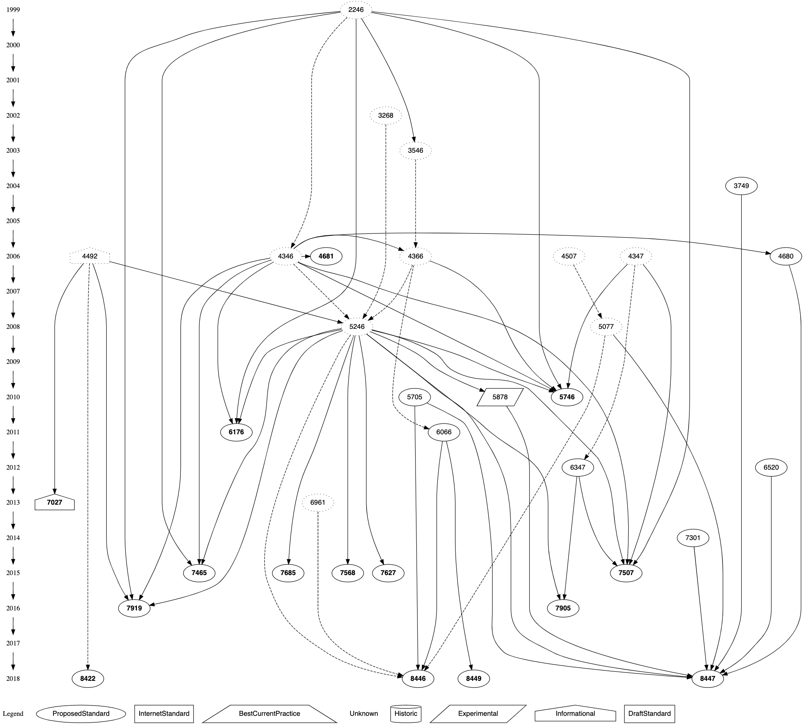

# rfc
Tools for handling IETF RFCs

## Example

    $ rfc -g -s 9 > ,x.dot
    $ dot -Tsvg ,x.dot >,x.svg

Print TLS protocol with timeline and legend:

    $ rfc -h -g -s 9 -r 4346 >,x.dot
    $ dot -Tsvg ,x.dot >,x.svg

